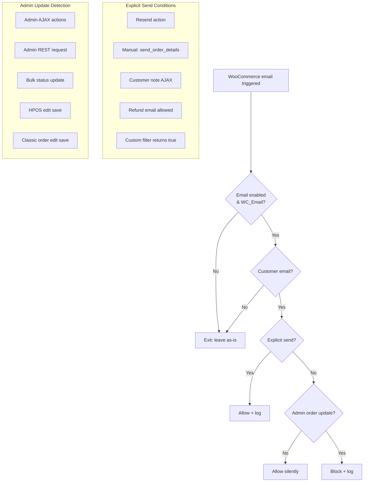

# WooCommerce Email Blocker (Admin Updates)

## Purpose
When enabled, this feature blocks **customer-facing WooCommerce emails** that would normally be sent as a side effect of **admin-initiated order updates**. Emails are only allowed if the admin explicitly triggered a send action (resend, customer note, manual "send order details", or refund emails if allowed).

## Settings

| Setting | Option Key | Default |
|---------|------------|---------|
| Block customer emails on admin updates | `wicket_admin_settings_woo_email_blocker_enabled` | Off |
| Allow refund emails from admin | `wicket_admin_settings_woo_email_blocker_allow_refund_emails` | Off |

**Location:** Wicket Settings → Integrations → WooCommerce

### Option Storage
Settings are stored in the `wicket_settings` option array:
```php
get_option('wicket_settings')['wicket_admin_settings_woo_email_blocker_enabled']
```

**Legacy fallback:** If not found in `wicket_settings`, the blocker checks the `wicket_woo_tweaks` option array with these keys:
- `wicket_woo_email_blocker_enabled`
- `wicket_woo_email_blocker_allow_refund_emails`

### Class Constants
```php
EmailBlocker::OPTION_ENABLED      // 'wicket_admin_settings_woo_email_blocker_enabled'
EmailBlocker::OPTION_ALLOW_REFUNDS // 'wicket_admin_settings_woo_email_blocker_allow_refund_emails'
```

## Entry Point
`WicketWP\Main::init()` instantiates and initializes the blocker:
```
src/Main.php → new WooCommerce\EmailBlocker() → EmailBlocker::init()
```

## Hook Registration
`EmailBlocker::init()` runs only when the setting is enabled **and** WooCommerce is active:

| Hook | Callback | Priority |
|------|----------|----------|
| `woocommerce_init` | `register_email_filters()` | 10 |
| `woocommerce_before_resend_order_emails` | `allow_for_resend()` | 5 |
| `woocommerce_new_customer_note` | `allow_for_customer_note()` | 5 |

## How Email Blocking Works

### Filter Scope
`register_email_filters()` loops all registered WooCommerce emails and attaches:
```php
add_filter('woocommerce_email_enabled_{email_id}', [$this, 'maybe_block_email'], 20, 3);
```

### Decision Flow (`maybe_block_email()`)
1. **Exit early** if email is already disabled or not a `WC_Email` instance.
2. **Exit early** if it's not a customer email (`$email->is_customer_email()` returns false).
3. **Allow** if any explicit send condition is true (see below).
4. **Block** only if the request is detected as an **admin order update**.

If blocked, the filter returns `false`, preventing the email from sending.

### Explicit Send Conditions
An email is explicitly allowed when any of these are true:

| Condition | Detection Method |
|-----------|------------------|
| Resend action triggered | Email ID marked via `allow_for_resend()` hook |
| Manual "Send order details" action | `wc_order_action=send_order_details` and email is `customer_invoice` |
| Admin adds a customer note | AJAX action `woocommerce_add_order_note` with `note_type=customer` |
| Refund email (when allowed) | Email ID is `customer_refunded_order` or `customer_partially_refunded_order` |
| Custom filter override | `wicket_woo_email_blocker_allow_send` filter returns `true` |

## How Admin Order Updates Are Detected
`is_admin_order_update_request()` handles detection across admin UI, REST, and AJAX flows.

### Admin Context Guard
The request must originate from **wp-admin**:
- For standard requests: `is_admin()` must return true
- For AJAX/REST: the HTTP referer must contain `/wp-admin/`

### Detection Paths
The request is considered an admin update when **any** of the following are true:

#### 1. Admin AJAX Actions
- **Trigger:** `wp_doing_ajax()` returns true
- **Actions:** `woocommerce_refund_line_items`, `woocommerce_mark_order_status`
- **Capability:** `edit_post` on the order, or `edit_shop_orders`/`manage_woocommerce`

#### 2. Admin REST Requests
- **Trigger:** `REST_REQUEST` constant is true
- **Requirements:** User must be logged in
- **Capability:** `edit_post` on the order, or `edit_shop_orders`/`manage_woocommerce`

#### 3. Bulk Status Update (Orders List)
- **Trigger:** Bulk action starts with `mark_` (e.g., `mark_processing`)
- **Order IDs:** Present in request via `id` or `post` parameter
- **Nonce:** Valid `bulk-orders` or `bulk-posts` nonce
- **Capability:** `edit_post` on the order (if identifiable) plus `edit_shop_orders`/`manage_woocommerce`

#### 4. HPOS Order Edit Save
- **Trigger:** `$_POST['action'] === 'edit_order'`
- **Nonce:** Valid `update-order_{order_id}` nonce
- **Capability:** `edit_post` on the order

#### 5. Classic Order Edit Screen Save
- **Trigger:** POST contains `post_ID`, `post_type`, and `woocommerce_meta_nonce`
- **Post type:** Must be a WooCommerce order type
- **Capability:** `edit_post` on the post

If none of these match, the request is **not** treated as an admin update and the email proceeds normally.

## Extension Points

### Filter: `wicket_woo_email_blocker_allow_send`
Override the allow/block decision for a specific email.

```php
/**
 * Allow a specific email type to bypass the blocker.
 *
 * @param bool     $allow Whether to allow the email. Default false.
 * @param WC_Email $email The email instance being evaluated.
 * @return bool
 */
add_filter('wicket_woo_email_blocker_allow_send', function (bool $allow, WC_Email $email): bool {
    // Example: Always allow "customer_on_hold_order" emails
    if ('customer_on_hold_order' === $email->id) {
        return true;
    }
    return $allow;
}, 10, 2);
```

## Logging
Every block/allow decision writes to the WooCommerce log at `info` level.

| Field | Description |
|-------|-------------|
| `source` | `wicket-woo-email-blocker` |
| `email_id` | The WooCommerce email ID |
| `decision` | `allow` or `block` |
| `reason` | `explicit` or `admin_update` |
| `order_id` | Order ID (if available) |
| `order_action` | Value of `wc_order_action` (if any) |

**Log location:** WooCommerce → Status → Logs → `wicket-woo-email-blocker-*`

## Troubleshooting

### Emails still being blocked when they shouldn't be
1. Check the WooCommerce logs for the `wicket-woo-email-blocker` source
2. Verify the action is detected as "explicit send" — look for `decision: allow, reason: explicit`
3. If using a custom flow, add the `wicket_woo_email_blocker_allow_send` filter

### Emails still sending when they should be blocked
1. Confirm the setting is enabled in Wicket Settings → Integrations → WooCommerce
2. Check that the request originates from wp-admin (referer check may fail for custom admin pages)
3. Verify the user has appropriate capabilities (`edit_shop_orders` or `manage_woocommerce`)

### Refund emails not sending
Enable **Allow refund emails from admin** in Wicket Settings → Integrations → WooCommerce.

Affected email IDs:
- `customer_refunded_order`
- `customer_partially_refunded_order`

## Flow Diagram


## Source Files
| File | Purpose |
|------|---------|
| `src/WooCommerce/EmailBlocker.php` | Core blocker logic |
| `src/Main.php` | Instantiation and initialization |
| `includes/admin/settings/class-wicket-settings.php` | Settings registration |
